### The CLEAR Method for Software Development

The CLEAR method offers a shared language between entrepreneurs, engineers, and AI. It defines how your product behaves before anyone writes a line of code. It replaces chaos with structure:

Context → Layout → Execute → Assess → Run

The CLEAR method is a structured, prompt-driven approach for iteratively developing an application. Each step in the process is initiated by a specific, well-defined prompt to ensure clarity and traceable outputs.

## Structured Prompts for Each Phase

The following prompts correspond to the nodes and steps detailed in the flowchart below:

| Phase/Node | File Output | Prompt  |
|------------|-------------|-------------------|
| C (Requirements) | prd.md | 'Create a product requirements document called prd.md for a modern AI chat application called Zen Chat that allows users to have real-time conversations with multiple AI models like GPT-4o.' |
| L (Architecture) | stack.md | 'Based on the @prd.md and @design.html, create a technical stack and architecture document called stack.md.' |
| L (TDD Plan) | plan.md | 'Create plan.md as a phased TDD implementation plan for @prd.md using @stack.md and @design.html' |
| L (Test Plan) | test.md | 'Create test.md as a test plan matching the phases in @plan.md. Make sure that each phase ends in human-verifiable outputs.' |
| E (Implement) | None | 'Implement phase X of the @plan.md' |
| A (Test/Report) | phase_X_report.md | 'Execute test in phase X of the @test.md and write phase_X_report.md' |
| C (Update) | None | 'Update the @stack.md, @plan.md and or @test.md according to Five Whys to prevent the mistake in the future' |
| E (Remediate) | None | 'Remediate phase_X_report.md.' |
| R (Run) | None | 'Ship!' |

## The CLEAR Method Flowchart

This flowchart shows the continuous integration and delivery loop, emphasizing the iterative nature of the development process.

```mermaid

graph TD
    %% Define Styles
    classDef planning fill:#90EE90,stroke:#3CB371,stroke-width:2px;
    classDef development fill:#ADD8E6,stroke:#4682B4,stroke-width:2px;
    classDef decision fill:#FFD700,stroke:#FFA500,stroke-width:2px;
    classDef remediation fill:#87CEEB,stroke:#4682B4,stroke-width:2px;
    classDef final fill:#E6E6FA,stroke:#9370DB,stroke-width:2px;    
    %% 1. Planning Phases (Light Green)
    B(Define Product Requirements - prd.md)
    C(Design Mockup - design.html)
    D(Define Technical Stack & Architecture - stack.md)
    E(Generate TDD Implementation Plan - plan.md)
    G(Generate Comprehensive Test Plan - test.md)

    B --> C --> D --> E --> G
    class B,C,D,E,G,T planning
    
    %% 2. Phase Loop
    subgraph Phase Loop["Phase Loop"]
        style Phase Loop fill:#F0F8FF,stroke:#B0C4DE,stroke-width:2px
        H[Implement Phase X of @plan.md]
        I[Execute Phase X of @test.md & Write phase_X_report.md]
        M{Done?}
        R{Last Phase?}
        
        H -- CLEAR --> I
        I --> M
        M -- Yes --> R
        R -- CLEAR --> H
        
        %% Remediation Loop
        subgraph Remediation Loop["Remediation Loop"]
            style Remediation Loop fill:#E6F3FF,stroke:#4682B4,stroke-width:2px
            T(Five Whys)
            K[Remediate phase_X_report.md]
            
            M -- No --> T
            T --> K
            K -- CLEAR --> I
        end
        
        class H,I development
        class M,R decision
        class T planning
        class K remediation
    end
    
    G --> H
    
    %% 3. Final Step (Purple)
    V(Ship Your Vision 🚀)
    R -- Yes --> V
    class V final
```

